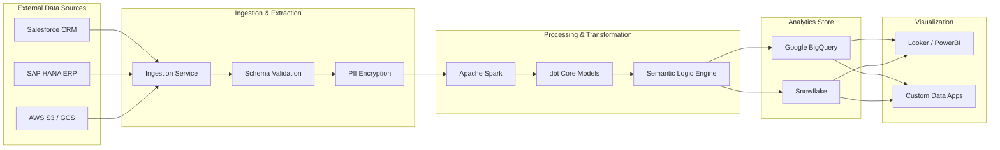
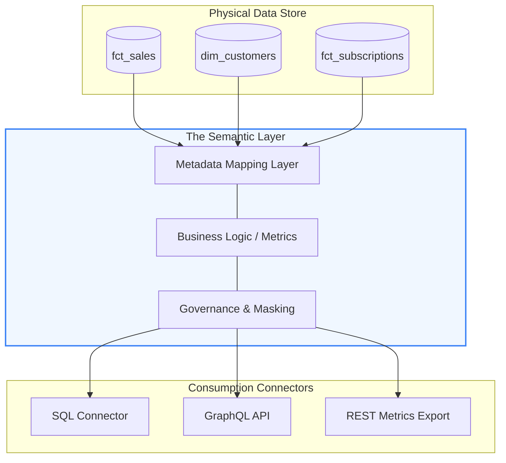
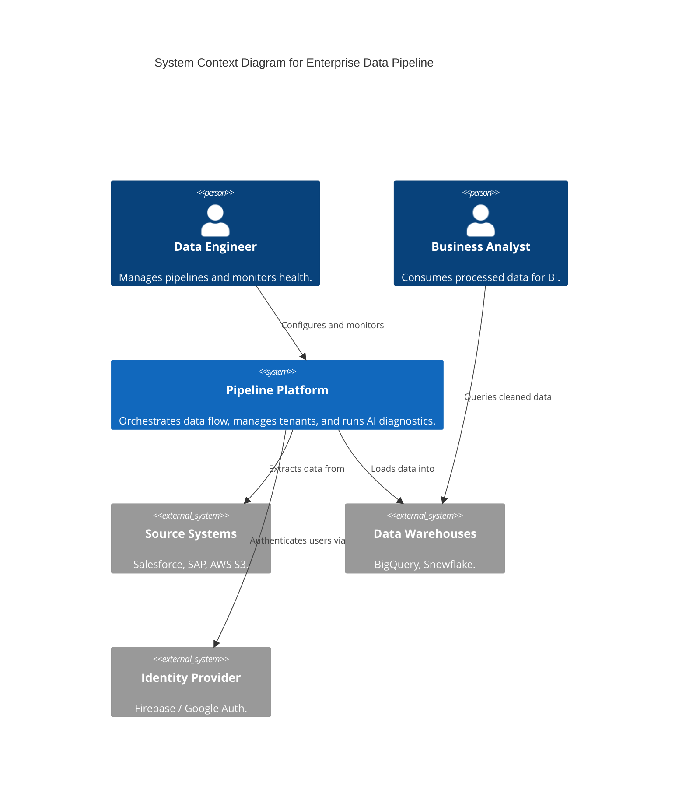
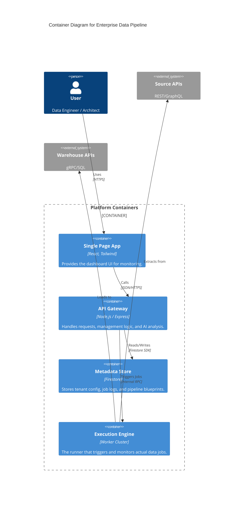

# 🏗 System Architecture & Data Flow

This document outlines the technical blueprints of the Enterprise Data Pipeline platform using Mermaid.js.

---

## 1. Data Flow Diagram (DFD)
This diagram illustrates the movement of data from external source systems through the internal processing layers to the final visualization endpoints.

---

## 2. Semantic Layer Diagram
The Semantic Layer acts as an abstraction between physical warehouse tables and business consumption, centralizing metric definitions.

---

## 3. C4 Model Diagrams

### Level 1: System Context Diagram
Shows the platform's relationship with external users and systems.

### Level 2: Container Diagram
Shows the high-level internal structure of the platform.

---

## 4. Key Architectural Pillars
1.  **Multi-Tenancy**: Data is strictly logically isolated at the API and Metadata layers.
2.  **AI-Resilience**: Gemini AI is integrated into the API gateway to analyze error logs fetched from the Metadata Store.
3.  **Stateless Compute**: The Execution Engine uses short-lived worker nodes for scalability.
4.  **Observer Pattern**: Every job emits events to the Metadata Store, which the SPA listens to in real-time.

---

## 🛠 Freeware Diagramming Tools
The diagrams above are written in **Mermaid.js** syntax. This is the industry standard for "Diagrams as Code."

*   **Viewing/Editing**: You can copy-paste the code blocks into the [Mermaid Live Editor](https://mermaid.live/) (Free/Open Source).
*   **Documentation**: Mermaid is natively supported by GitHub, GitLab, and VS Code (via plugins), allowing you to keep diagrams in sync with your source code.
*   **Exporting**: These tools allow you to export high-resolution PNG, SVG, or PDF files for inclusion in slide decks.
