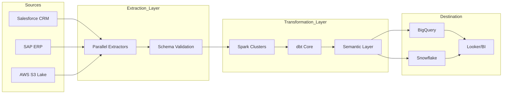
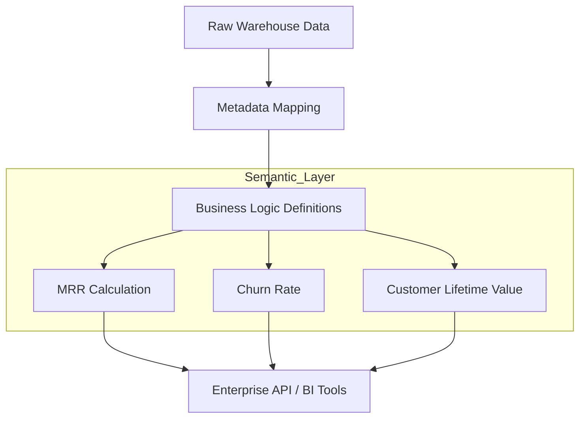

# 🚀 Enterprise Data Pipeline: Executive Demo Script

This document provides a structured narrative and technical blueprint for showcasing the platform to C-suite stakeholders and lead architects.

---

## 🎙 Part 1: The Vision (Introduction)
**Narrative**: 
> "In the modern enterprise, data is the engine, but the 'plumbing'—the pipelines—is often a black box. Most companies find out their data is 'broken' only after it hits a boardroom dashboard. Our platform turns that black box into a glass house. We provide global observability, AI-driven resilience, and multi-tenant transparency in a single pane of glass."

---

## 📊 Part 2: Page-by-Page Script

### 1. The Command Center (Overview Dashboard)
*   **Action**: Click **Overview** in the sidebar.
*   **Key Talking Points**: 
    *   **Success Rate (98.2%)**: "We don't just run jobs; we guarantee outcomes."
    *   **Freshness Scoreboard**: "Real-time SLA tracking. If Salesforce data is stale, we know before the sales VP does."
    *   **System Pulse**: "Infrastructure health monitoring at the edge."

### 2. The Blueprint (Pipeline Maps)
*   **Action**: Click **Pipeline Maps**.
*   **Key Talking Points**:
    *   **Visual Lineage**: "Hover over these nodes. This is the 'Extract-Transform-Load' life cycle visualized. It's not just a drawing; it's a real-time health map of our topology."
    *   **Redundancy**: "Note the 3x redundancy factor. If one compute cluster fails, the pipeline reroutes automatically."

### 3. Operational Excellence (Job Manager)
*   **Action**: Click **Job Manager**.
*   **Key Talking Points**:
    *   **Deep-Dive Logs**: "Total auditability. Every execution is containerized and logged at the micro-second level."
    *   **Performance Analytics**: "Identify bottlenecks. We can see which SQL transformations are consuming 80% of our compute budget."

### 4. AI Resilience (Incident Center)
*   **Action**: Click **Support/Incidents**.
*   **Key Talking Points**:
    *   **AI Root Cause Analysis**: "When a job fails at 3 AM, our integrated Gemini AI performs an instant post-mortem. It doesn't just say 'error'; it provides a remediation plan."

---

## 📐 Part 3: Technical Diagrams

You can copy and paste these into any **Mermaid.js** editor (like [Mermaid Live](https://mermaid.live/)) or view them directly in AI Studio if a Mermaid plugin is installed.

### 1. Data Flow Diagram

### 2. High-Level Architecture

### 3. The Semantic Layer Blueprint
**Purpose**: Decoupling physical data from business logic.

---

## 💎 Step 4: Semantic Layer Value Proposition
Explain this to the Lead Architect:
*   **Single Source of Truth**: Metrics like "Revenue" are defined once in the semantic layer, ensuring Looker and Tableau show the EXACT same number.
*   **Language Agnostic**: Users can query the layer using SQL or GraphQL.
*   **Security**: Data masking and column-level security are enforced here, before data reaches the end-user.
